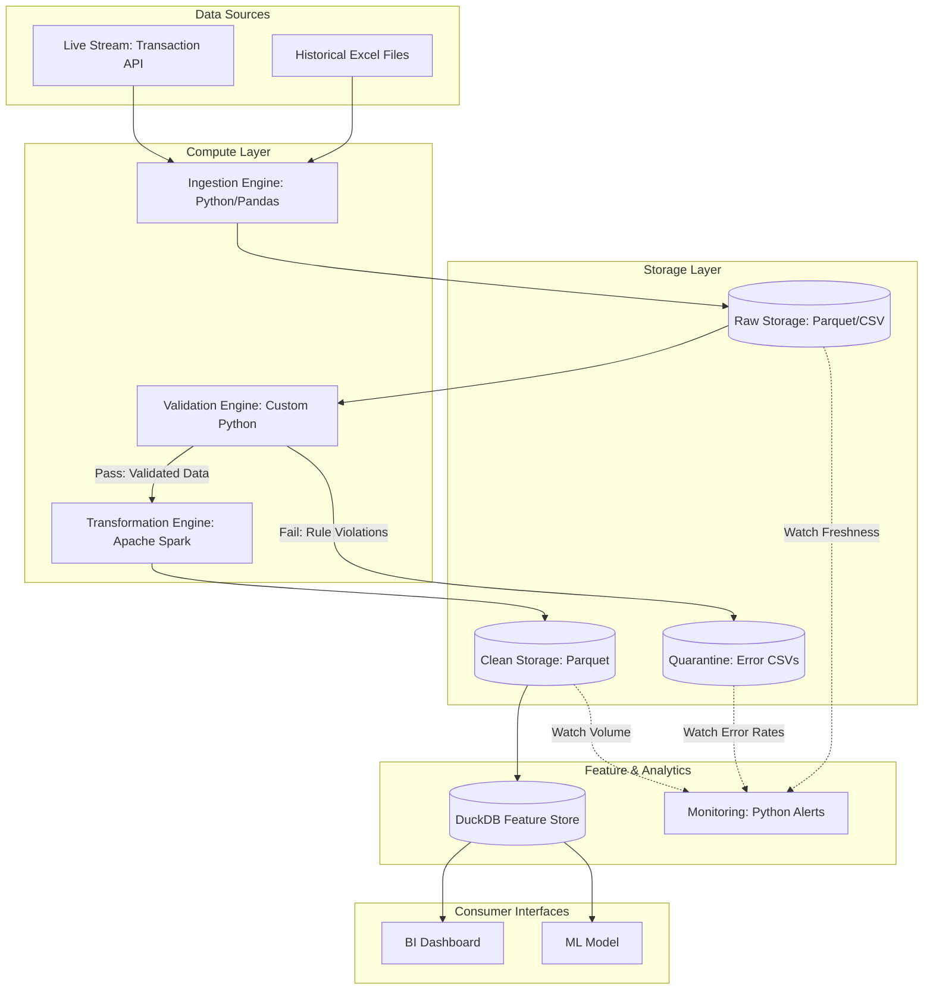

# Data Pipeline Architecture Design: Online Retail

This document outlines the end-to-end data pipeline architecture for an online retailer, designed for high reliability, observability, and scalability.

---

## Task 1: Pipeline Architecture Diagram

### 1.1 — Architecture Overview

# 1.2 — Component Descriptions

### **Data Sources (A1 & A2)**
This component represents the origin of all data entering the pipeline. It handles **Historical Excel Files** used for backfilling past trends and a **Live Stream API** that feeds transaction events into the system as they occur. By combining these, the pipeline can provide both historical context and real-time insights.
* **Input/Output:** Receives external business records; produces raw data streams.
* **Tech/Format:** Uses `.xlsx` workbooks and `JSON` API payloads.

---

### **Compute Layer (B1, B2, B3)**
The **Compute Layer** is responsible for all data movement and logic. The **Ingestion Engine** (Python/Pandas) reshapes source data into a standard structure, the **Validation Engine** (Custom Python) enforces data quality rules, and the **Transformation Engine** (Apache Spark) handles high-volume cleaning and complex math. This layer ensures that only accurate, high-value data survives the journey.
* **Input/Output:** Receives raw sources; produces standardized, clean, and enriched datasets.
* **Tech/Format:** Uses **Python/Pandas** for initial tasks and **Apache Spark** for heavy lifting.

---

### **Storage Layer (C1, C2, C3)**
The **Storage Layer** is physically separated from the compute to allow for independent scaling. It consists of **Raw Storage** for the initial landing, **Quarantine** for records that failed validation (**Error CSVs**), and **Clean Storage** for high-performance, schema-consistent data. This design protects the system by keeping "dirty" data separate from the high-quality files used for analysis.
* **Input/Output:** Receives compute outputs; produces persistent Parquet and CSV files.
* **Tech/Format:** Uses **Parquet** for storage efficiency and **CSV** for human-readable error logs.

---

### **Feature & Analytics (D1 & D2)**
The **Feature Store** (DuckDB) acts as a high-speed library for pre-calculated business metrics like "Total Customer Spend." Simultaneously, the **Monitoring** component watches the storage layers to ensure data is arriving on time and that error rates aren't too high. This layer turns processed data into "ready-to-use" information while keeping the system healthy.
* **Input/Output:** Receives clean data; produces fast query results and health alerts.
* **Tech/Format:** Uses **DuckDB** for analytical querying and **Python-based** monitoring scripts.

---

### **Consumer Interfaces (E1 & E2)**
This is the final delivery point where data meets the business. The **BI Dashboard** connects to the storage layer via SQL to show daily revenue reports, while the **ML Model** pulls specific data features to predict customer behavior or detect fraud. This ensures that both human decision-makers and automated algorithms have the data they need.
* **Input/Output:** Receives feature data; produces visual reports and predictive scores.
* **Tech/Format:** Connects via **SQL** for BI and **REST APIs** for machine learning inference.

---

## Task 2: Validation and Error Handling Design

### 2.1 — Validation Rules

To ensure data integrity, every record passing through the **Validation Engine** (B2) is evaluated against the following rules:

#### **Schema Validations** (Structural Correctness)
1.  **InvoiceNo**: Must be a non-empty string.
2.  **StockCode**: Must be a non-empty string.
3.  **Quantity**: Must be an integer (required).
4.  **InvoiceDate**: Must be a valid datetime object (format: `YYYY-MM-DD HH:MM:SS`).
5.  **UnitPrice**: Must be a float or decimal (required).
6.  **Country**: Must be a non-empty string (required).

#### **Value Range Validations** (Sensible Values)
7.  **Quantity Range**: `Quantity` must not be 0. (Positive for sales, negative for returns).
8.  **Price Range**: `UnitPrice` must be greater than or equal to 0.0.
9.  **CustomerID Range**: If provided, `CustomerID` must be a 5-digit numeric value (10000–99999).

#### **Business Rule Validations** (Domain Logic)
10. **Cancellation Logic**: If `InvoiceNo` starts with 'C', then `Quantity` **must** be negative.
11. **Sale Consistency**: If `InvoiceNo` does *not* start with 'C', then `Quantity` **must** be positive.
12. **Description Integrity**: If `UnitPrice` is greater than 0, the `Description` must not be empty or "Unknown".

---

# 2.1 — Validation Rules

To maintain the integrity of the **Clean Storage** layer, the following validation rules are applied to all incoming data (historical batch and live stream).

### **1. Schema Validations (Structural Correctness)**
These checks ensure that the data structure is sound before it enters the processing pipeline.
* **Mandatory Field Enforcement:** The fields `StockCode`, `CustomerID`, `Quantity`, `UnitPrice`, `InvoiceDate`, and `Country` must contain data. If any of these are null, the record is immediately sent to Quarantine. 
* **The "Fill-then-Verify" Description Rule:** While a `Description` should not be null in the final dataset, it is not rejected immediately. The system first attempts to recover missing descriptions using business logic (see below). If it remains null after the recovery attempt, the record is rejected.
* **Date Standardization:** The `InvoiceDate` must strictly conform to the `YYYY-MM-DD HH:MM:SS` format. Records with unparseable or corrupted date strings are rejected to ensure chronological accuracy in reporting.
* **Core Identifier Presence:** `StockCode` must be present and valid. Any record missing a `StockCode` is categorized as unrecoverable and moved to the dead-letter area.

---

### **2. Value Range Validations (Sensible Values)**
These rules ensure the numerical data falls within logical, real-world boundaries.
* **Quantity Logic:** Every transaction must have a `Quantity` strictly greater than zero (`Quantity > 0`). Records with zero or negative quantities (not marked as returns) are treated as invalid.
* **Pricing Floor:** `UnitPrice` must be greater than or equal to zero (`UnitPrice >= 0`). This allows for $0.00 promotional items but flags any negative prices as data corruption.

---

### **3. Business Rule Validations (Domain Logic)**
These rules apply specific retail knowledge to filter and enrich the data.
* **Sales-Only Filtering (Cancellations):** Any `InvoiceNo` starting with the character **'C'** is identified as a cancellation. These records are removed from the main sales stream and diverted to keep the Clean Storage layer focused solely on successful transactions.
* **Description Recovery Strategy:** Before a record is discarded for a missing description, the pipeline executes a recovery attempt:
    1. It identifies the `StockCode` of the incomplete record.
    2. It performs a lookup across the historical dataset to find all entries with the same `StockCode`.
    3. It identifies the **statistical mode** (the most frequent description) used for that item.
    4. If a match is found, the description is auto-filled. If no match exists, the record fails the final null check.
* **Anomaly & Outlier Tagging:** To prevent skewed analysis, any `UnitPrice` or `Quantity` exceeding the **99th percentile** of historical data is flagged. These are not deleted but are marked with an `is_suspicious` boolean flag to alert analysts of potentially extreme or erroneous values.

----

### 2.2 — Error Handling Flow

When a record fails validation, it is routed through one of the following paths based on the severity of the failure:

| Failure Category | Record Action | Storage Location | Alerting Strategy | Recovery Mechanism |
|---|---|---|---|---|
| **Schema Violation** (e.g., missing ID) | **Rejected Entirely**: Record is blocked from downstream layers to prevent pipeline crashes. | **Quarantine: Error CSVs (C2)**: Logged as a raw entry with error metadata. | **High Severity**: Immediate Slack alert if error rate > 1% in 5 mins. | Manual re-ingestion after fixing source or updating the schema definition. |
| **Value Range Failure** (e.g., Price < 0) | **Quarantined**: Record is moved to a separate table for engineering review. | **Quarantine: Error CSVs (C2)**: Marked for review in a daily batch. | **Medium Severity**: Daily summary report sent to the data engineering team. | Automated retry after applying a "default" correction (if applicable) or manual SQL update. |
| **Business Rule Violation** (e.g., C-Invoice with Positive Qty) | **Flagged & Quarantined**: Record is isolated but kept for potential historical context. | **Quarantine: Error CSVs (C2)**: Tagged with `business_logic_error`. | **Low Severity**: Weekly data quality audit review. | Source-side fix followed by a batch re-run for that specific `InvoiceNo`. |

**Recovery Process**:
1.  **Identification**: Engineers query the **Quarantine Storage** (C2) to identify clusters of errors (e.g., a new product code with a zero price).
2.  **Correction**:
    -   *Option A*: Fix the upstream source data (e.g., in the Excel file or API payload).
    -   *Option B*: Update the validation rule if the "error" is actually a valid new business case.
3.  **Reprocessing**: Trigger a partial re-run of the **Compute Layer** (B2/B3) using only the corrected raw files to update the **Clean Storage** (C3).

---

## Task 3: Transformation and Storage Design

### 3.1 — Defined Transformations

# Data Pipeline Architecture & Design Specification

## 1.1 — End-to-End Architecture
(Refer to the uploaded architecture diagram showing the modular flow from Ingestion through Storage to Consumer Interfaces.)

## 1.2 — Component Descriptions

### **Data Sources**
Captures all raw inputs into the system. It handles **Historical Excel Files** for deep historical context and a **Live Stream API** for real-time transaction events.
* **Input/Output:** Receives external business records; produces raw data streams.
* **Tech/Format:** `.xlsx` and `JSON`.

### **Compute Layer**
The processing engine of the pipeline. The **Ingestion Engine** (Python/Pandas) standardizes incoming data. The **Validation Engine** (Custom Python) enforces data contracts, and the **Transformation Engine** (Apache Spark) handles massive cleaning and aggregation tasks.
* **Input/Output:** Receives raw sources; produces validated and enriched datasets.
* **Tech/Format:** Python, Pandas, and Apache Spark.

### **Storage Layer**
Designed for independent scaling. It includes **Raw Storage** (the landing zone), **Quarantine** (for sidelined errors), and **Clean Storage** (the source of truth).
* **Input/Output:** Receives compute outputs; produces persistent Parquet and CSV files.
* **Tech/Format:** Parquet (performance) and CSV (error logging).

### **Feature & Analytics**
The **DuckDB Feature Store** allows for ultra-fast querying of final metrics. The **Monitoring** component (Python Alerts) watches all storage layers for freshness, volume, and error rates.
* **Input/Output:** Receives clean data; produces fast query results and system health alerts.
* **Tech/Format:** DuckDB and Python.

---

## 2.1 — Validation Rules

* **Schema:** `StockCode`, `CustomerID`, `Quantity`, `UnitPrice`, `InvoiceDate`, and `Country` must not be null.
* **Range:** `Quantity > 0` and `UnitPrice >= 0`.
* **Business Logic:** * **Cancellations:** Filter out `InvoiceNo` starting with 'C' to maintain a pure sales layer.
    * **Description Recovery:** Use `StockCode` mode to heal missing descriptions; reject if unresolvable.
* **Outliers:** Flag records in the 99th percentile with `is_suspicious = True`.

---

## 2.2 — Error Handling & Recovery

| Failure Category | Record Action | Storage Location | Alerting Strategy | Recovery Mechanism |
| :--- | :--- | :--- | :--- | :--- |
| **Schema Violation** | Rejected Entirely | Quarantine (C2) | High: Immediate Alert | Manual re-ingestion |
| **Value Range** | Quarantined | Quarantine (C2) | Medium: Daily Summary | SQL update or auto-retry |
| **Business Rule** | Flagged/Quarantined | Quarantine (C2) | Low: Weekly Audit | Source fix & re-run |

---

# 3.1 — Defined Transformations

All transformations are designed to be **idempotent**, meaning re-running them on the same input data produces the same output without creating duplicates or logical errors.

| Transformation | Input | Output | Idempotency Strategy | Detailed Logic |
| :--- | :--- | :--- | :--- | :--- |
| **Cleaning & Standardization** | Validated Raw Data (C1) | Cleaned Records (C3) | **Overwrite Partitions** | Uses `overwrite` mode for specific date partitions. This ensures that if a day's data is re-processed, the old records are replaced rather than duplicated. |
| **Derived Column: LineTotal** | `Quantity` & `UnitPrice` | `LineTotal` (Float) | **Stateless Math** | Calculated dynamically using simple deterministic math ($Qty \times Price$). Since it relies only on the row's values, it is inherently safe to re-run. |
| **Cancellation Flagging** | `InvoiceNo` | `IsCancellation` (Bool) | **Stateless Mapping** | Checks if `InvoiceNo` starts with 'C'. Logic is repeatable and does not rely on external state or previous runs. |
| **Temporal Components** | `InvoiceDate` | `Year`, `Month`, `Hour` | **Deterministic Extraction** | Extracts standard time features from the timestamp. Essential for time-series analysis and identifying peak shopping hours. |
| **Customer Aggregations** | Cleaned Records (C3) | `TotalSpend`, `OrderCount` | **Key-Based Upsert** | Uses `CustomerID` as a unique key. The process overwrites the existing aggregation for that specific customer period to prevent double-counting revenue. |
| **ML Feature: ReturnsRate** | Aggregated Transactions | `% of C-Invoices` | **Window Re-calculation** | Re-calculated weekly based on the full historical window for each customer to ensure the ratio remains accurate as they make more returns. |

---

### **ML Feature Deep-Dive: Predictors for Churn**

To differentiate our predictive capabilities, we engineer three specific behavior "signals" into the final feature store:

1.  **Recency Velocity:** We don't just measure "days since last purchase," but rather the ratio of their *current* gap compared to their *average* gap. A customer who usually shops weekly but hasn't visited in 14 days is a higher churn risk than a monthly shopper who hasn't visited in 14 days.
2.  **Purchase Interval Volatility:** We calculate the standard deviation of the time between orders. Increasing volatility (erratic behavior) is a mathematically proven precursor to total customer churn.
3.  **Promotion Dependency (Hot Day Sensitivity):** We measure the percentage of a customer's total lifetime value (LTV) that was generated on `is_hot_day = True`. This identifies "discount-only" shoppers who have low brand loyalty and high churn probability once sale cycles end.

---

# 3.2 — Storage Layer Design

The pipeline follows a tiered storage strategy that ensures data is preserved for recovery while being optimized for high-speed end-user access.

| Layer | Contents | Format | Partitioning Key | Retention Strategy |
| :--- | :--- | :--- | :--- | :--- |
| **Raw (C1)** | Unprocessed Excel & API records | **Parquet** | `ingestion_date` | **Permanent Archive:** Essential for re-processing history if logic changes. |
| **Clean (C3)** | Validated, schema-consistent records | **Parquet** | `invoice_date` | **Full Lifecycle:** Maintained for multi-year trend analysis and auditing. |
| **Feature (D1)** | Aggregated metrics & ML features | **DuckDB** | `CustomerID` (Index) | **Active Window:** Rolling 18-month window to support ML lookback. |

---

### **Format & Design Justification**

#### **1. Why Parquet for Raw and Clean?**
* **Who & How:** These layers are designed for **Apache Spark**. Because Parquet is a columnar format, it allows Spark to "skip" irrelevant columns during massive transformation jobs, significantly reducing I/O.
* **Storage Growth:** As we accumulate millions of transactions, Parquet’s **Snappy compression** keeps storage costs low. It is built to scale to terabytes efficiently.
* **Time-Travel:** By using `ingestion_date` partitioning in the Raw layer, we support a manual form of time-travel. Engineers can point a script to a specific date folder to see exactly what data hit our system on that day, regardless of when the purchase actually happened.

#### **2. Why DuckDB for the Feature Layer?**
* **Who & How:** This layer is accessed by the **BI Dashboard** (via SQL) and the **ML Model** (via API).
* **Low-Latency Performance:** DuckDB is chosen because it provides **sub-second query responses**. While Spark is good for big batches, DuckDB is optimized for the "point-and-click" experience a manager expects from a dashboard.
* **Feature Serving:** It allows the ML model to retrieve a customer’s entire profile (Recency, Frequency, etc.) instantly during a prediction task.

#### **3. Retention Logic**
* **Raw & Clean:** We keep these for the "Full Lifecycle" of the project. If a bug is found in our validation rules a year from now, having the Raw data allows us to "rewind" and fix the data correctly.
* **Feature Layer:** We use a **rolling 18-month window**. Since our pipeline is **Idempotent**, this layer is essentially a "cache." If we ever need older features, we can simply re-generate them from the Clean layer, allowing us to keep this high-speed storage layer lean and fast.

---

# 3.3 — Incremental Update Strategy

The pipeline is designed to process only "delta" data (new changes) to minimize compute costs and maintain low latency in the Feature Store.

### **1. Tracking Progress: The High-Water Mark (HWM)**
We use a **High-Water Mark** strategy to track the progress of the pipeline. 
* **Mechanism:** The system maintains a metadata table in our Compute Layer that stores the `max(ingestion_timestamp)` from the last successful run.
* **Filtering:** On the next run, the Ingestion Engine only queries records where `ingestion_timestamp > HWM`. This ensures we never re-process old files, even if they remain in the landing zone.

### **2. Handling Late-Arriving Records**
In real-world streams, records often arrive out of order due to network lag. We handle this using a **Grace Period Watermark**:
* **The 30-Minute Window:** We implement a 30-minute "lookback" window. While the HWM moves forward, the pipeline still scans for any records with a transaction time (`InvoiceDate`) that falls within the last 30 minutes of the HWM.
* **Deduplication:** To prevent duplicates during this overlap, we pass the data through a **DropDuplicates** transformation in Spark, keyed by a composite of `InvoiceNo` + `StockCode` + `CustomerID`. This allows late data to "catch up" without corrupting our totals.

### **3. Customer Feature Refresh Logic**
Customer-level features (like Recency and Volatility) are stateful and require a specific refresh strategy:
* **Trigger-Based Updates:** Features are not refreshed on every single micro-batch. Instead, they are updated on a **Daily Sliding Window** (typically during low-traffic hours at 3:00 AM).
* **Incremental Aggregation:** Rather than re-scanning the entire multi-year history of a customer, we pull the existing profile from the **DuckDB Feature Store**, add the "delta" transactions from the last 24 hours, and calculate the new metrics.
* **Atomic Swap:** Once the new features are calculated, we perform an **Atomic Swap** in DuckDB. This ensures that the BI Dashboard and ML Model never see a "half-finished" table during the update process.

### **4. Idempotency in Incremental Loads**
To ensure the system remains idempotent during incremental updates:
* We use **Overwrite Partitions** for date-based data. If a specific day's incremental load fails and is re-run, the system clears that day's partition in the **Clean Storage** before writing the new data, preventing duplicate records.
---